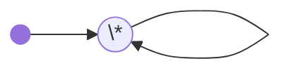
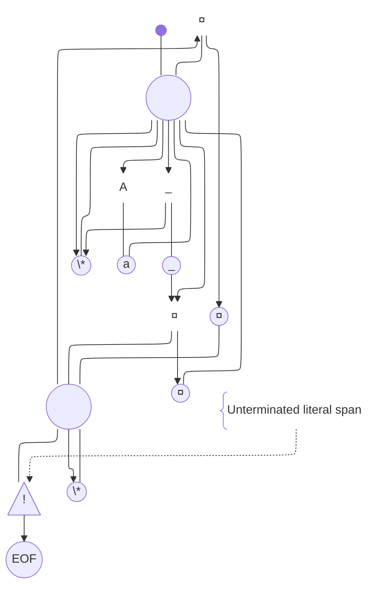
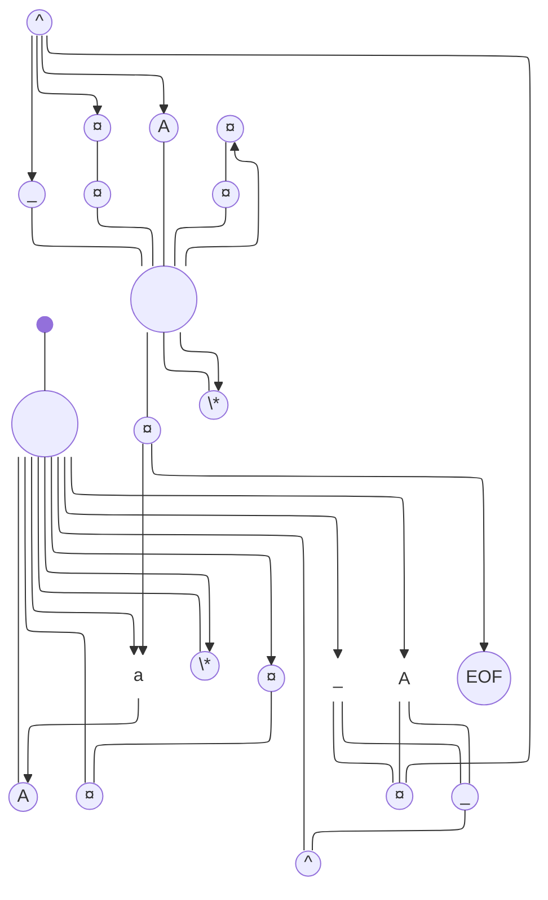

# ROR (Read, Output, Repeat) Diagram

## Todo

- ROR coffee mug
- ROR logo (lion head clipart split into 8x8 pixel chunks on a grid with a 2px margin)

A mix between a railroad diagram and a state diagram. ROR Diagrams are precise enough so one can manually process input by reading them and following edges and nodes.

ROR Diagrams are used to unambiguously program a working parser that covers edge cases properly.

Written as a flowchart.

## How to read

From the starting point, follow the arrow to the node matching the next character, or * as a last resort if nothing else matches.

If you traverse circled nodes without arrows on the way, output those characters.

Once you reach the node connected with an arrow, read the character it contains. If the node is circled, output it as-is, too.

Repeat until EOF is outputted.

## Character node labels for CASECTL

Symbol|Character represented
A|uppercase letter
a|lowercase letter
_|E1 (escape 1), aka underscore
¤|EN (escape N), aka currency sign
EOF|End of file, ends processing when outputted. Must be the last "character" read.
^|Last read character. Cannot be used before at least one character has been read.
*|Literally anything else (default case). Should always be present if all other node labels aren't present.

## Character nodes

Node shape|Edge heads reaching the node|Behavior|
Empty (just the label)|Arrow|Read a character
Circle|Arrow|Read a character and output it as-is
Circle|None|Output a character

## Warning node

Node Shape: warning sign (triangle with exclamation point inside)

Behavior: outputs a warning to stderr when traversed

## Junction node

Node shape: empty circle (no label)

Behavior: none, act as an intersection between multiple edges.

When connected to, a junction always acts a last resort choice. This is useful to reuse large sections of the diagram.

## Start node

Node shape: filled circle

Behavior: indicates the starting point of processing. Usually connected to a junction.

## Comment node

Node shape: curly brace on the left

Behavior: none. Linked to another node with a dotted link.

Can be linked to a comment node, to comment a comment. Looping comment chains are discouraged.

## Basic diagram (outputs everything as-is)

## CASECTL diagrams

### Lowercase

### Uppercase

